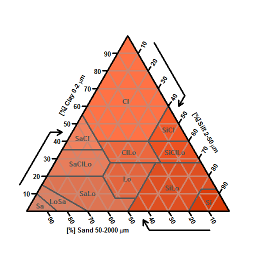

soiltexture: The Soil Texture Wizard
====================================

Page content: 
[In short](#inshort) &middot; 
[Introduction](#intro) (_this section_) &middot; 
[Installation](#installation) &middot; 
[Text based graphical user interface](#text_gui) &middot; 
[Usage](#usage) &middot; 

In short    
--------

*   Author: **Julien MOEYS** ([SLU][]/[CKB][]).
*   Package on CRAN: http://cran.r-project.org/web/packages/soiltexture/index.html 
*   Project page on R-forge: http://r-forge.r-project.org/projects/soiltexture/ 
*   Code Repository (R-forge): http://r-forge.r-project.org/scm/?group_id=740 

Introduction    
------------

`soiltexture` is a [package][R_packages] (_extension_) for 
the [R][], a _free software environment for statistical_ 
_computing and graphics_.

`soiltexture` is a toolbox for plotting, classifying and 
transforming [soil texture][soil_texture] data (clay, 
silt and sand contents).

Soil texture data and soil [texture classifications systems][texture_classif] 
are traditionally visualised (plotted) on [ternary diagrams][ternary_plot]  
(called texture plots, texture diagrams or texture triangles).

`soiltexture` currently implements 17 soil texture classification 
systems from all around the world. See [here][triangle_gallery] 
for a gallery of available texture triangles, and see also 
the package vignette (_after [installing](#installation)_ 
_the package_):

    vignette( "soiltexture_vignette" )

Installation    
============

Install R
---------

You need to install beforehand the sofware [R][] ("_a free_ 
_software environment for statistical computing and graphics_").

From R homepage, go to the [CRAN homepage][CRAN] or (_better_) choose 
the nearest [CRAN mirror][CRAN_mirrors].

From there, choose 'Download R for ...' (Windows, Mac or Linux), 
and then choose 'base' or 'install R for the First time'.

From there (latest stable R release), download the software 
installation files (if you are running on Windows) and install 
the program on your computer (follow the instructions from the 
installer). 

Note: Unless you know what you are doing, it is recommended 
to install the latest R release (it may not always be possible 
to install the package `soiltexture` on older versions of R, 
or some of the latest features might be missing).

Install soiltexture (stable release)
------------------------------------

Open R, and type the command:

    install.packages( "soiltexture" ) 

Install soiltexture (development version)
-----------------------------------------

Note: This will only work with the latest (stable) version 
of R. You should also check on the package R-forge page 
(here: http://r-forge.r-project.org/R/?group_id=740) that 
the "Build status" of `soiltexture` is "Current" (and not 
"Failed to build").

Open R, and type the command:

     install.packages("soiltexture", repos="http://R-Forge.R-project.org") 

Text based graphical user interface    
===================================

From version `1.3.0` the package soil texture comes along 
with a simple [text-based graphical user interface][text_gui]. 

After you have [installed](#installation) `R` and the package 
`soiltexture`, simply start R and type:

    soiltexture::soiltexture_gui()

This will start the text-based graphical user interface. You 
will be asked a series of simple question (4 to 8. With a list 
of possible answers), to import soil texture data, visualise 
it on a texture triangle and classify the texture data according 
to a classification system. Without typing any other commands 
than the one above. You can also display an empty texture 
triangle (without data-points) and/or display a texture triangle 
without classification system.

More information on how to prepare your soil texture data 
can be found on the function help page. In R, type:

    help( "soiltexture_gui" )

or simply

    ?soiltexture_gui

Note: An alternative way to call `soiltexture_gui` is to type:

    library( "soiltexture" ) 
    soiltexture_gui()

Usage    
=====

<!-- List if links  -->
[R]:                http://www.r-project.org/ "R software homepage" 
[R_packages]:       http://en.wikipedia.org/wiki/R_%28programming_language%29#Packages "R packages (Wikipedia)" 
[text_gui]:         http://en.wikipedia.org/wiki/Text-based_user_interface "Text-based user interface (Wikipedia)" 
[soil_texture]:     http://en.wikipedia.org/wiki/Soil_texture "Soil texture (Wikipedia)" 
[texture_classif]:  http://en.wikipedia.org/wiki/Soil_texture#Soil_texture_classification "Soil texture classification (Wikipedia)" 
[ternary_plot]:     http://en.wikipedia.org/wiki/Ternary_plot "Ternary plot (Wikipedia)"
[triangle_gallery]: http://julienmoeys.info/2015/02/06/texture-triangle-gallery/
[SLU]:              http://www.slu.se/en/ "Swedish University of Agricultural Sciences"
[CKB]:              http://www.slu.se/en/collaborative-centres-and-projects/centre-for-chemical-pesticides-ckb1/ "The Centre for Chemical Pesticides (CKB)"
[CRAN]:             http://cran.r-project.org/ "The Comprehensive R Archive Network"
[CRAN_mirrors]:     http://cran.r-project.org/mirrors.html "CRAN Mirrors"

